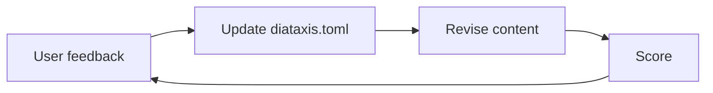

+++
title = "Why Structure First"
weight = 31
description = "How diataxis.toml works and how to maintain it"
topic = "structure-document"
covers = ["Why the structure document exists", "Why structure changes before content", "How guidance fields prevent regressions", "The relationship between covers and scoring", "Why diataxis/ is output-only and separate from other docs"]
detail = "Discuss the design rationale. Connect to the user's experience of documentation that drifts or regresses. Use a mermaid diagram to illustrate the revision cycle."
+++
The most distinctive aspect of this tool's workflow is the insistence that
`diataxis.toml` is updated before any content changes. This is a deliberate
design decision, not a bureaucratic hurdle.

## The problem: documentation drift

Documentation projects tend to drift in two ways. Content drifts from its
original purpose — a tutorial gradually accumulates explanation, a reference
doc starts including step-by-step instructions. And the project as a whole
drifts from its plan — topics get added ad hoc, gaps appear, some areas get
exhaustive treatment while others are neglected.

Both kinds of drift happen slowly. No single commit looks wrong. But over
time, the documentation becomes a patchwork that doesn't serve anyone well.

## The structure document as a contract

`diataxis.toml` addresses drift by making the plan explicit and machine-readable.
The `covers` field for each file is a contract: these are the things this file
must address. The `detail` field sets expectations about depth and format. The
`guidance` field carries forward lessons learned.

When you score documentation, you score it against this contract. A tutorial
that drifts into explanation will fail the quadrant purity check. A reference
doc that skips items in `covers` will fail the coverage check. The structure
document makes drift measurable.

## Why structure changes come first

When a user asks to revise content — "make this simpler," "add a section about
X," "don't use that analogy" — the tempting thing is to jump straight into the
file and start editing. But if you do, the structure document no longer matches
the content. The next time someone (or something) regenerates or scores that
file, the old guidance applies, and the user's feedback is lost.

By updating `diataxis.toml` first — rewriting the `guidance` field to
incorporate the feedback, adding items to `covers` if needed — the feedback
becomes part of the contract. It persists across regeneration. It gets checked
during scoring. It can't be silently undone.

## The revision cycle

The structure-first approach produces a clear cycle:

The structure document is always the first thing updated and the last thing
checked. Content changes flow from it, and scoring validates against it.

## The guidance field as institutional memory

The `guidance` field evolves over time. It starts as a brief for initial content
generation: "use a simple example," "keep it under 500 words." As the project
matures, it accumulates the lessons learned from user feedback and scoring
results: "users found the pizza analogy confusing — use number lines instead,"
"this section needs at least two worked examples."

The key rule: feedback is integrated into the existing guidance text, not
appended as a separate block. The guidance should always read as if it were
written from scratch with full knowledge of everything learned so far. This
prevents the field from becoming a changelog and keeps it useful as a
generation brief.

## Why diataxis/ is separate and output-only

A project may already have technical specs, API docs generated from code,
architecture decision records, READMEs, or design documents. Those are
authoritative sources for development and design. Diataxis documentation is
different — it is a human-friendly artifact derived from the system, not the
system itself.

This distinction is why Diataxis content lives in its own `diataxis/` directory
rather than alongside other documentation. It is strictly an endpoint: produced
for human consumption, never consumed as input by any other process. No build
step, CI pipeline, code generator, or LLM should read from `diataxis/` as a
source of truth. If the code and the Diataxis docs disagree, the code is right
and the Diataxis docs need updating.

The `diataxis/` directory includes a `README.md` making this explicit, and the
skill adds a note to the project's `CLAUDE.md` so that Claude Code sessions
don't treat the content as authoritative.

## Parallel generation

A secondary benefit of the structure-first approach: because each file's
requirements are fully specified in `diataxis.toml`, files can be generated
independently and in parallel. Each subagent receives the full structure
document (for cross-linking context) but only needs to write its assigned
file. This scales well for large documentation projects.

For the specific fields and their formats, see the
[diataxis.toml Schema](/reference/diataxis-toml-schema/). To see the
structure document in action, try the
[Writing diataxis.toml](/tutorials/writing-diataxis-toml/) tutorial.
